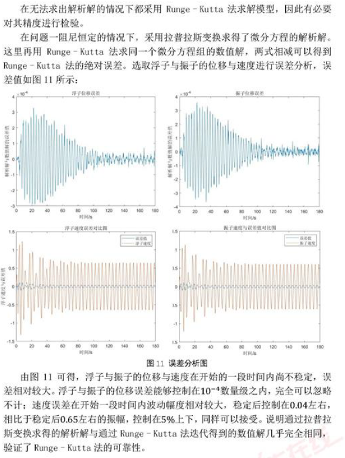
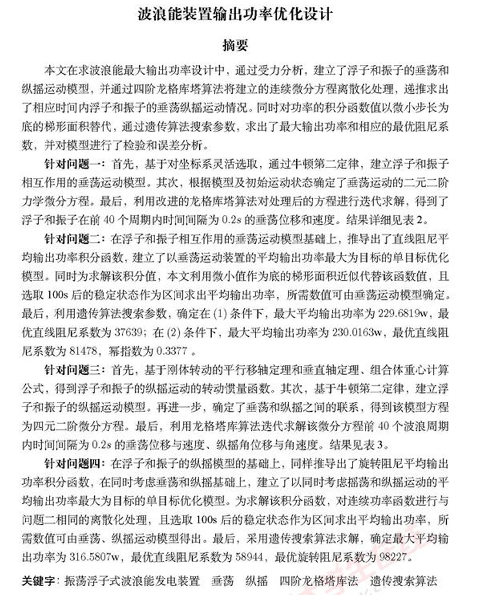
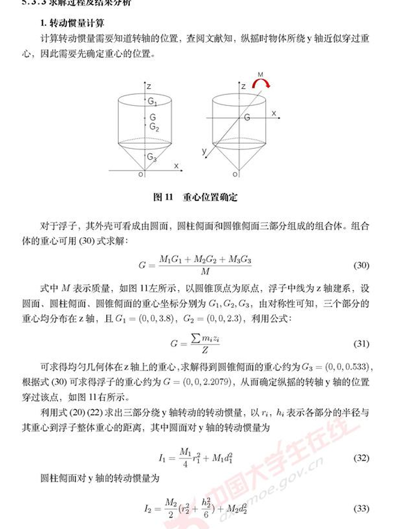
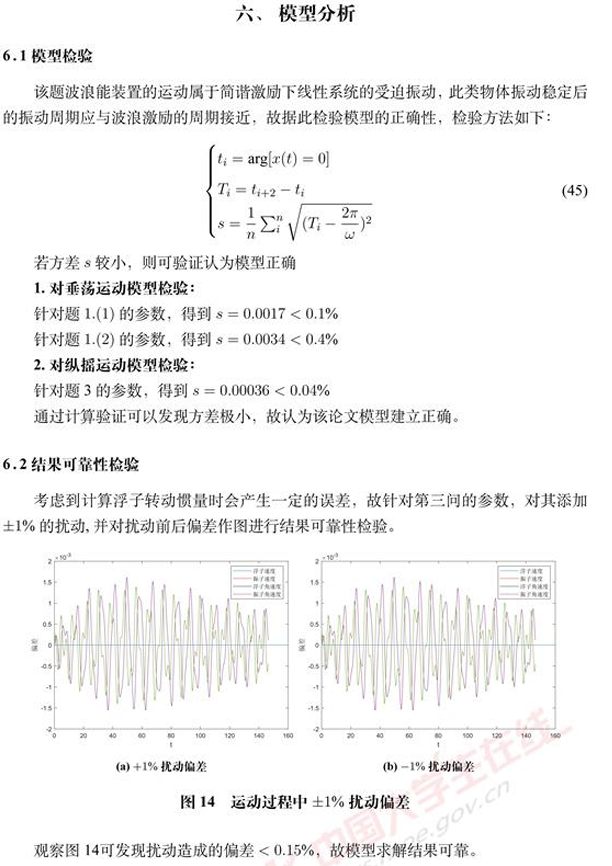
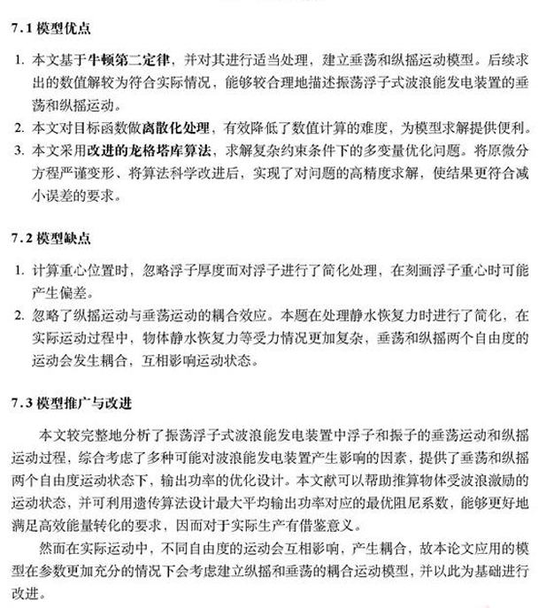
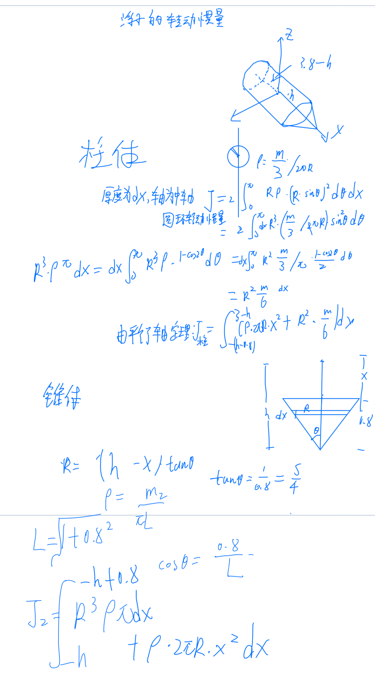

# 2022年国赛A题

## 官方解答


模型

第二类拉格朗日方程

质心


转动惯量

参考系变化

程序


---

## A171 

### 摘要：


---

### 第一问

微分方程为**`二阶常系数和非常系数非齐次线性微分方程组`**，该文用拉普拉斯变换法求常系数微分方程解析解，非常系数用龙格库塔求解，对于数值解（可能存在误差）做了误差分析  证明可靠性

（且可解出第二问第一小问的解析解

> **拉普拉斯变换法**：常微分方程 138~145
>
> 这里的解析解是用**Wolfram Mathematica** 算的

论文内容：

1. 做了平衡状态下和运动状态下的受力分析     运动状态下受力分析和平衡状态时做对比
2. 受力分析+推导 + 牛二律 得出模型
3. 两小问求解：阻尼系数恒定和非恒定
4. 结果曲线，给出的曲线是浮子位移+振子相对浮子位移曲线（**避免了振子位移被浮子覆盖导致看不清振子位移的现象**
5. 模型求解：解法简介 +  解的结果展示（符号解，数值解，图）


> **Question**  数值解法用的matlab中的ode45  但在论文中给出了经典四阶龙格库塔公式，事实上matlab ode45 是45阶龙格库塔，且四阶龙格库塔公式不只一种


#### issue 4 圆锥是否浮出水面

论文处理方法：


---

### 第二问：

> 力电比拟法  对 问题进行转化  同样是解析+数值  

数值方法求解得到的速度数据是离散的，求功要对离散数据进行数值积分（梯形法   traphz

数值方法即为一个优化问题（变量是一维以及二维的）


> **Question **  没有对浮子的圆锥部分是否会浮出水面进行约束或讨论

#### issue 6  振子内部运动是否和浮子有发生接触

论文处理：作为约束的限制条件

> 应该不用考虑，若发生碰撞，则有能量的损失。若不加约束，而优化的最优结果显示没发生碰撞，说明其他情况即使无碰撞所产生的能量也不如最优情况（视结果而定


---

### 第三问：

> 1. 分别考虑垂荡和纵摇，不考虑两个运动间的耦合关系，做了假设 （故垂荡模型完全不变
> 2. 且在做纵摇运动时，使用整体法，假设浮子和振子的相对角位移较小，振子的中轴和浮子中轴平行
> 3. 变换了转轴位置（原本是系统的质心处，而与海水有接触的实际上只有浮子，故文章认为所有题目给的力矩作用点是在浮子质心处


参考系变换


假设的合理性：（题目中的


> 故运动模型：


> 模型求解：龙格-库塔


> **Question1** x1 x2 应该是theta1 和theta2    F2 和F3 应该是M2 和M3
>
> **Quetion2** 对于振子的转动 没有考虑重力矩  （重力分解到沿轴方向和垂直轴方向，在垂直轴方向和支持力抵消了？

#### issue 3 密度均匀

论文处理：按面积均匀，但面积好像算错了


#### issue 1  转轴的确定

  依据参考文献所得 静水恢复力等力都是作用在质心上面的 故 它的质心是任意取得


文献：(但是一本书 无法考证)


质心计算公式： 应该错了  后面那项算的是圆柱体


振子转轴显然

#### issue 2 转动惯量的计算

这里推导并不详细


#### issue 4 纵摇时圆锥是否浮出水面

根据假设，纵摇和垂荡相对独立，类似第一问可分析垂荡运动中圆锥部分是否浮出水面，且在文中完全没有出现关于这一点的讨论

#### issue 7 结果分析

通过实验结果对假设以及模型的合理性进行说明


---

### 第四问：

无解析解，同样是一个优化问题（数值解法


#### issue 4 垂荡及纵摇时圆锥是否浮出水面

没有考虑

### 模型假设、检验和推广、参考文献


> 解析解 与 数值解的比较（只做了第一小问 。 实际还有第二问第一小问也是解析+数值，也可以进行分析
>
> 直观展示出数值方法的解析法之间的误差




### code

1. 对于求符号解，用了Wolfram Mathematica   并能将结果直接导入matlab  与matlab交互
2. 封装函数很清晰
3. 符号的使用大多是阿拉伯：omega，alpha，beta 微分dxdt=  001=1;
4. 优化直接用matlab工具箱
5. 数值积分函数trapz  （梯形法
6. 代码 most elegant

```matlab

```


---


## A022

### 摘要


### 第一问

运动模型相同，数值解

#### issue 4 垂荡及纵摇时圆锥是否浮出水面或者圆柱部分是否完全沉入水面


#### issue 6  振子内部运动是否和浮子有发生接触

无

---

### 第二问

> 1. 解析解+数值解  结果比较   较第一篇更数学  （求解析解原理：受迫振动最终运动频率和所受力的频率相同 ，故可设x=x_max*cos(wt)     [【简谐运动】19.受迫振动与共振_哔哩哔哩_bilibili](https://www.bilibili.com/video/BV1434y1a7LP/?spm_id_from=333.337.search-card.all.click&vd_source=25ec95a39ea01b5e4c245abea27420f0)
> 2. 解析解法：表达式+求导求极值


#### issue 4 垂荡及纵摇时圆锥是否浮出水面或者圆柱部分是否完全沉入水面


---

### 第三问

> 同样分析浮子的垂荡运动时没有考虑纵摇（认为角位移是小量
>
> 但在分析振子的垂荡运动时考虑了纵摇的影响
>
> 而根据垂荡运动的初步结果，认为他们之间的相对位移也是小量，据此在分析浮子的纵摇运动时，认为浮子和振子是整体的（因为文章认为题目给的力矩的转轴在浮子和振子这一整体的质心上的 （整体法），而随着振子的垂荡作用，整体的质心会发生改变。）  与第一篇相比，第一篇认为作用点是浮子的质心
>
> 再去分析振子的纵摇运动


> 模型看不懂，几乎没有推导 （第三问        （解 ： 这里是非惯性系


> 初步计算
>
> 这里   y1 不知道是什么 第二条式子公式右边很奇怪（解 ： 这里是非惯性系


纵摇运动模型： 


#### issue 3 密度均匀

按面积密度均匀

#### issue 1  转轴的确定


 整体的质心（or say 重心）（文献  没标明

#### issue 2 转动惯量的计算

无详细推导

​														浮子质心距离转轴位置o的距离：


---

### 第四问

---

### 模型假设、检验和推广、参考文献


---

### code

---

## A001

这篇有 丶 抽象，用事实证明自己写的龙格库塔其实也行，没有调包。不数学  偏算法  没有解析解   算力惊人  代码能力也很猛

但说的改进算法其实没有     且 第三问 认为转轴在质心，但扭转弹簧和阻尼器对浮子的力矩是以o点为转轴的，选取的转轴不同没有注意到这一点


### 摘要



### 第一问

与前类似

#### issue 4 垂荡及纵摇时圆锥是否浮出水面或者圆柱部分是否完全沉入水面

作为优化的约束条件

#### issue 6  振子内部运动是否和浮子有发生接触

无

---

### 第二问

遗传算法

---

### 第三问

类A171

#### issue 1  转轴的确定

认为在质心 

#### issue 2 转动惯量的计算




---

### 第四问


---

### 模型假设、检验和推广






---

### code

除了遗传算法，代码几乎都是基础实现的

MATLAB遗传算法工具箱 ： https://blog.csdn.net/viafcccy/article/details/94429036


---


## issue

### issue 1  转轴的确定

三篇文章  第一篇静水恢复力矩等作用点是浮子和振子的整体的质心  第二篇认为静水恢复力矩等力矩对应转轴是浮子和振子的整体的质心 （和他们建立的模型有关        13 都是隔离法   2用了整体法（都是选择了能使模型简化的那种

若是以第一篇的思路，则力的作用点已知，则可将各个力矩的作用点统一到一个点上

而第二篇通过假设 使用整体法 即可以不用对浮子进行单独的分析 规避了这个问题


显然第二篇的模型更优美一点 第一篇参考文献无法找到，无法考证，更像是一个假设， 且不考虑耦合计算结果明显有问题，倾向于后者


第三篇 这里根本没考虑 


文献： 质心    事实上可以选取任意转轴（可进行转化），但要清楚题目所给力矩的作用点在哪里


> 外力作用点 ： 浮子的质心        or         浮子和振子的整体的质心       （倾向于前者

### issue 2 转动惯量的计算


> 浮子质心的计算：
>
> l是圆锥的母线长
>
> 应该是距离底端 ans = 2.2298


> 振子转动惯量的计算：
>
> 有圆柱体的转动惯量计算公式：[常见几何体转动惯量公式推导 - 知乎 (zhihu.com)](https://zhuanlan.zhihu.com/p/466928586)
>
> 其中L 是圆柱母线长    R是底面半径长度


> 浮子的转动惯量



matlab求解结果为：

总 = 圆柱 + 圆锥

```matlab
ans = 8.4223e+03
```

```matlab
ans = 3.6139e+03
```

```matlab
ans = 4.8085e+03
```

### issue 3 密度均匀

面积均匀

### issue 4 垂荡及纵摇时圆锥是否浮出水面或者圆柱部分是否完全沉入水面

前两篇都有考虑，具体方法为先假设，后验证。第三篇没有，但有加入优化问题的约束条件中

### issue 5 刚性微分方程


> 具体实例参见 [几类常微分方程的matlab求解方法 | 刚性微分方程、隐式微分方程、微分代数方程_matlab常微分方程_深海深夜深的博客-CSDN博客](https://blog.csdn.net/weixin_42019459/article/details/123302398)

*注：刚性问题——在用微分方程描述的一个变化过程中，往往又包含着多个相互作用但变化速相差十分悬殊的子过程，这样一类过程就认为具有“刚性”。描述这类过程的微分方程初值问题称为“刚性问题”。例如，宇航飞行器自动控制系统一般包含两个相互作用但效应速度相差十分悬殊的子系统，一个是控制飞行器质心运动的系统，当飞行器速度较大时，质心运动惯性较大，因而相对来说变化缓慢；另一个是控制飞行器运动姿态的系统，由于惯性小，相对来说变化很快，因而整个系统就是一个刚性系统。*

> Matlab求解微分方程
>
> 如何选择求解器[常微分方程 - MATLAB & Simulink - MathWorks 中国](https://ww2.mathworks.cn/help/matlab/ordinary-differential-equations.html?s_tid=CRUX_lftnav)


### issue 6  振子内部运动是否和浮子有发生接触

只有第二篇考虑会不会碰到顶端，纵摇是否会导致相撞都没有考虑


## Total

1. 官方模型考虑了两个运动的耦合效应 ， 拉格朗日公式  但没有具体求解
2. A171 和 A001 没有考虑两个运动间的耦合效应，运动模型基本相同  A022 有浮子没有考虑 振子考虑了和耦合
3. 应该是第二篇文章的模型更优一点（较其他两篇          
4. 三篇论文最终的结果都很接近
5. 圆柱体的转动惯量网上有现成公式，查略可能比推导节省时间
6. 可学用Wolfram Mathematica 或 matlab 符号计算进行 推导和积分求导等复杂运算 （可以节省时间和降低算错的概率
7. 导数符号可用原符号上加一点表示，可让公式看起来更简洁
8. 个人感觉论文写的好的： A171
9. 除了模型和求解内容外，对结果分析 模型检验较多的： A022
10. 自己实现龙格库塔 ： A001
11. else ： 存在误差的加扰动验证模型稳定性。通过else 知识 验证模型的准确性  对假设进行检验
12. 


训练

模型建立艰难

静水恢复力

圆锥露出水面

两种运动耦合导致方程变为刚性微分方程 无法求解


## 问题三模型建立和求解

发现考虑耦合效应时模型过于复杂，故假设浮子和振子在微波周期激荡力作用下做纵摇运动的角位移是小量，不影响他们的垂荡运动


初步计算，假定不考虑二者的耦合效应，建立模型 如图：

计算结果：


结果分析：

浮子和振子的角位移的振幅大致为0.05  * 360 = 18°     该角度显然还是较大，显然模型具有一定误差

但稳定时浮子和振子的相对角位移量级为1e-3 

下面考虑垂荡运动和纵摇运动的耦合效应

由于扭转弹簧刚度过大，导致扭转弹簧很难发生形变，即角位移相对弹簧刚度是小量，导致微分方程呈刚性，较为复杂，且难以求得解析解和数值解，故对模型做一定简化。

由于浮子在线性周期微幅波作用下，且扭转弹簧刚度较大的情况下，浮子和振子做纵摇运动的相对角位移及浮子在水中做纵摇运动的角位移是小量，故可近似认为浮子只做垂荡运动
